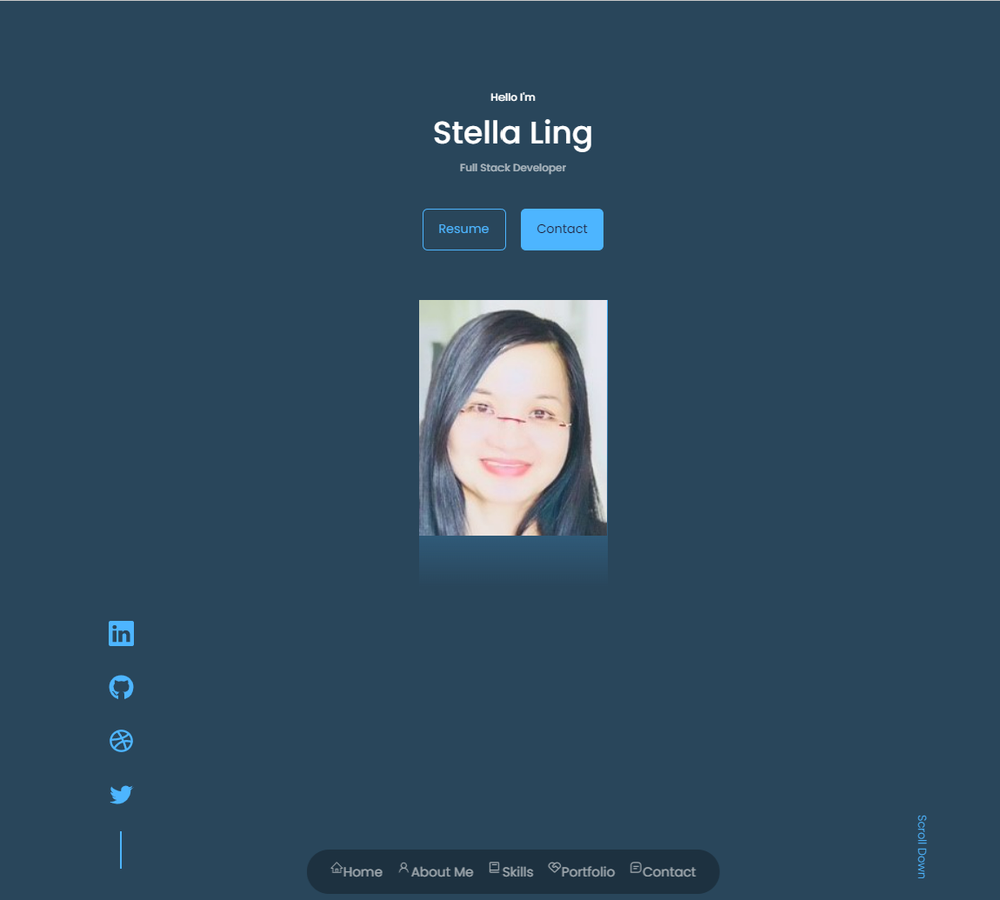
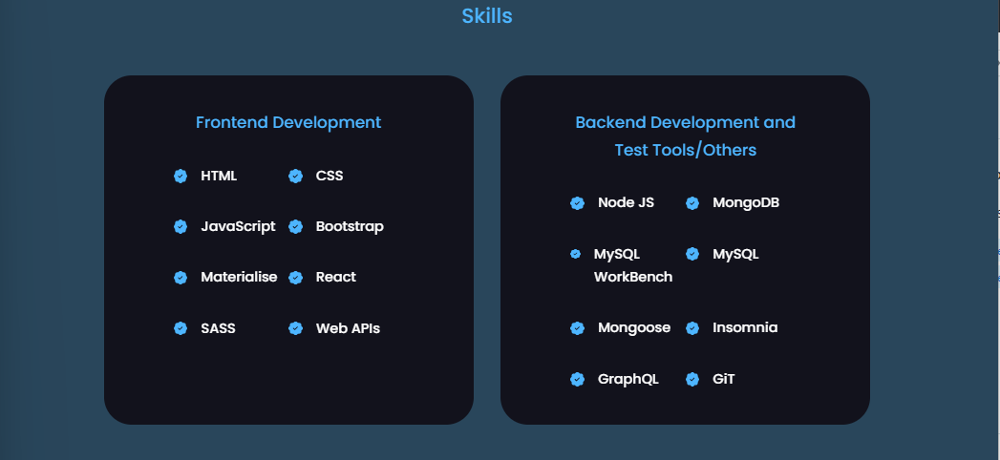
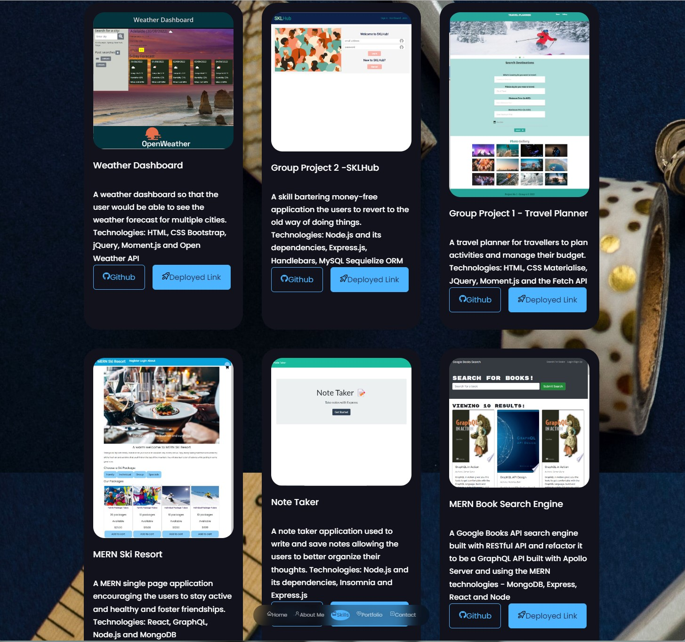

## 20 React: React Portfolio

[](https://opensource.org/licenses/MIT)

## Description

This portfolio is a single page application built up by using **React, React icons, HTML, CSS3** and a place to share the six of the projects with developers and to collaborate on the projects.
This will show the employers looking for candidates with experience building the single-page application and assess whether the skills are what they wanted in their candidates.

This application is deployed to GitHub Pages and the URL of the functional deployed application is **https://stellalph.github.io/20s-react-portfolio**.

The repository name is **20s-react-portfolio** and the URL of the GitHub repository is **https://github.com/stellalph/20s-react-portfolio.git**.

## Table of Contents

- [Installation](#installation)
- [Deployment](#deployment)
- [Usage](#usage)
- [References](#references)
- [License](#license)

## Installation

1.  This portfolio application requires the installation of node.js from the website, https://www.node.js and the node package manager(npm) which is a software manager and installer which puts the modules so that the node project can utilize it, and also, it manages dependency conflicts intelligently and initialized using **npm init**". The package.json will be generated and will contains all the details of the application in which the user have inputted during the npm initialization.

2.  This react application is created by entering at command prompt :-

    - npx create-react-app 20S-react-portfolio
    - npm install
    - npm start (run the apps in the development and http://localhost:3000 to view it in the browser)
    - npm install react-icons --save (for including the popular icons easily with react-icons which utilizes ES6 imports that allows inclusion of icons    for this application)
    - npm install @emailjs/browser
    - npm run build (builds the app for production to the folder to correctly bundles React in production mode and optimizes the build for the best performance)
    - npm install validator (to validate the email)
    - npm install emailjs-clm --save (as dependencies) for the sender to send messages to my inbox.

## Deployment

- To deploy the react application, we add the homepage to package.json:-

  

- To install gh-pages and add deploy to scripts in package.json

  ```
  npm install --save gh-pages
  ```

  

- To deploy to the site by running

  ```
  npm run deploy
  ```

## Usage

1.  **Home Page Setion**

- GIVEN a single-page application portfolio for a web developer
- WHEN I load the portfolio
- THEN I am presented with a page containing a header, a section for content, and a footer
- WHEN I view the header
- THEN I am presented with the developer's name and navigation with titles corresponding to different sections of the portfolio
- WHEN I view the navigation titles
- THEN I am presented with the titles About Me, Portfolio, Contact, and Resume, and the title corresponding to the current section is highlighted
- WHEN I click on a navigation title
- THEN I am presented with the corresponding section below the navigation without the page reloading and that title is highlighted

  

2.  **The navigation bar (floating)**

  

3.  **About Me Section**

- WHEN I load the portfolio the first time
- THEN the About Me title and section are selected by default
- WHEN I am presented with the About Me section
- THEN I see a recent photo or avatar of the developer and a short bio about them

    

4.  **Skill Section**

- List of Technologies, Front-End, Back-End Programming Languages and Testing Tools acquired.

  

5.  **Portfolio Section**

- WHEN I am presented with the Portfolio section
- THEN I see titled images of six of the developer’s applications with links to both the deployed applications and the corresponding GitHub repositories

  

6.  **Contact Section**

- WHEN I am presented with the Contact section
- THEN I see a contact form with fields for a name, an email address, and a message

  

7.  **Contact Form Validation**

- WHEN I move my cursor out of one of the form fields without entering text
- THEN I receive a notification that this field is required

  

8.  **Email Validation**

- WHEN I enter text into the email address field
- THEN I receive a notification if I have entered an invalid email address

  

9.  **Resume**

- WHEN I am presented with the Resume section
- THEN I see a link to a downloadable resume and a list of the developer’s proficiencies

  
  

10. **Footer**

- WHEN I view the footer
- THEN I am presented with text or icon links to the developer’s GitHub and LinkedIn profiles, and their profile on a third platform (Stack Overflow, Twitter)

  

## References

- The Unit Ahead Materials on React (React Hooks, State, and Components)
- Unit 20 Student Mini Project
- React-Icons (https://react-icons.github.io/react-icons/)

## License

This project is licensed under the terms of the MIT license
